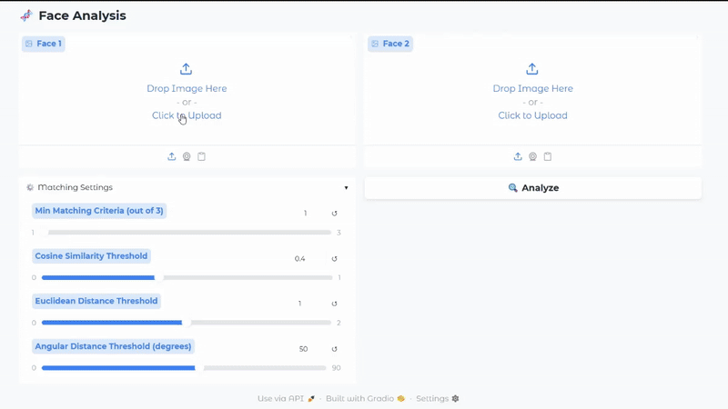
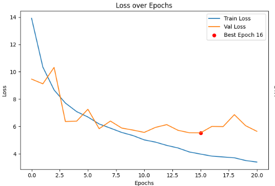
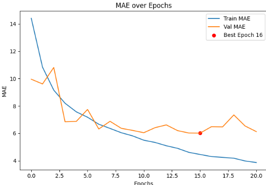
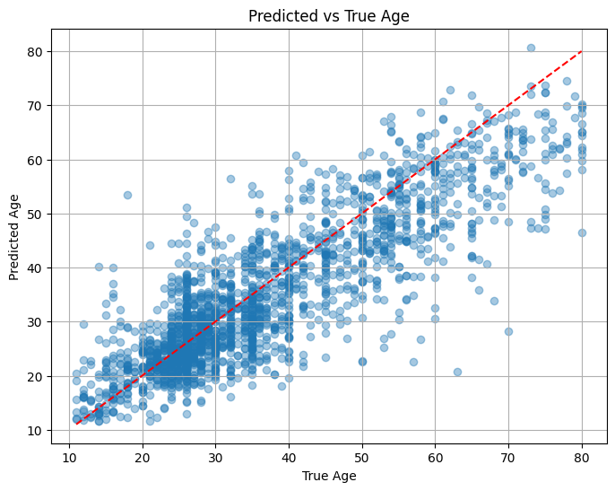
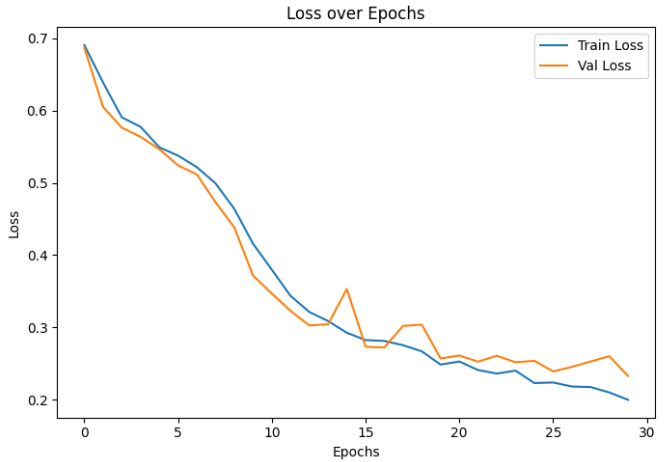
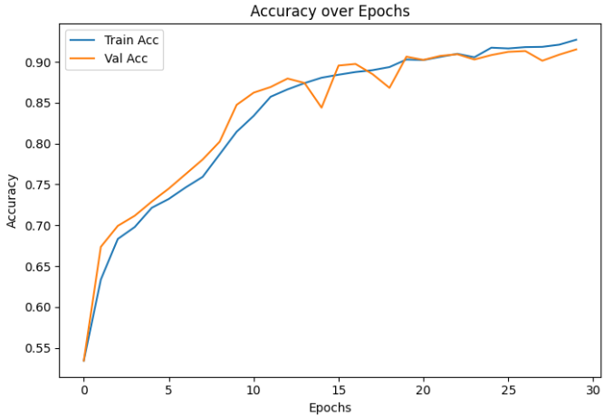
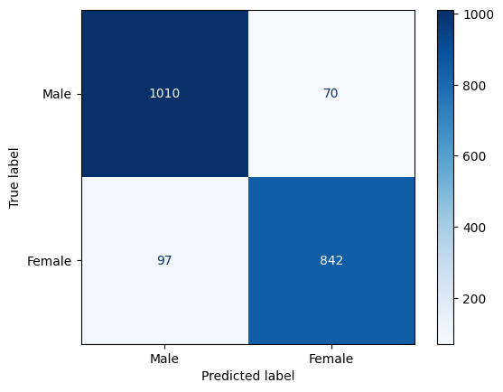

# 🧬 F-Eve: Facial Evolution Verification Engine

Upload two face images to analyze age, gender, and identity match using DL-based face analysis.

<p align="center">
   
</p>


<div align="center"> Dataset used for this task was  
<a href = "https://www.kaggle.com/datasets/moritzm00/utkface-cropped?resource=download"> aligned & cropped UTKFaces </a> </div>

---
<div align="center">

| [✨ Features](#-features) | [📁 Project Structure](#-project-structure) | [🚀 How to use](#-how-to-use) | [📊 Results](#-results) | [🙏 Acknowledgments](#-acknowledgments) |
| ---- | ---- | ---- | ---- | ---- |

</div>

<div id="features">

## ✨ Features

- **Age & Gender Prediction**: Predicts the age and gender of each detected face using deep learning models.
- **Face Detection**: Uses `InsightFace` for accurate face localization and embedding extraction.
- **Face Matching**: Compares two faces using:
  - Cosine Similarity
  - Euclidean Distance
  - Angular Distance
- **Voting System**: Flexible threshold-based voting to determine if two faces match.


</div>

<div id="-project-structure">

## 📁 Project Structure

```
F-Eve/
├── app.py                 # Gradio app
├── functions.py           # model functions
├── requirements.txt       # Python dependencies
├── dataset.txt            # Dataset link
├── models.txt             # Models link
├── Testing.ipynb          # Testing and experiments
├── Data Preparation.ipynb # Data preparation
├── Face Matching/         
│   └── Face Matching.ipynb    # Face matching workflow
├── Gender/                
│   ├── Augmentation.ipynb     # Data augmentation for gender
│   ├── Train.ipynb            # Training gender model
│   └── Test.ipynb             # Testing gender model
├── age/                   
│   ├── Augmentation.ipynb     # Data augmentation for age
│   ├── Train.ipynb            # Training age model
│   └── Test.ipynb             # Testing age model
├── assets/                # Example images and demo               
└── README.md              # Project documentation
```
</div>

<div id="-how-to-use">

## 🚀 How to use

1. **Clone the repository**
   ```bash
   git clone <repository-url>
   cd F-Eve
   ```

2. **Install dependencies**
   ```bash
   pip install -r requirements.txt
   ```

3. **Download  models**
   - Ensure the required models **<a href="https://drive.google.com/drive/folders/1AMoeN3mh0CdaLwFzGaYOEvqLu1zP4Dq2?usp=sharing">Here</a>** files (`vgg_age.h5`, `squeeze_gender.h5`) are in the project root or specify their paths in `app.py`.

### Usage

1. **Launch the web interface**
   ```bash
   python app.py
   ```

2. **Open your browser**
   - Navigate to the URL shown in the terminal (usually `http://127.0.0.1:7860`)

3. **Analyze faces**
   - Upload two face images
   - Adjust matching criteria (cosine, euclidean, angle thresholds)
   - View age, gender, and match results in real time

</div>

<div id="-results">

## 📊 Results

### 1. Age Prediction Results

<div align="center">

| Model         | Train Loss | Val Loss | Test Loss | Train MAE | Val MAE | Test MAE |
|--------------|------------|----------|-----------|-----------|---------|----------|
|   VGG16*    |     `3.0023`       |    `5.6436`      |  `5.5907`         |   `3.47`        |  `6.12`       |  `6.07`        |
|  SSRNet_DEX     |       4.8839     |  6.3573        |   5.8166        |  5.36         |  6.84       |  6.29        |

</div>

**Best Model (VGG16) Visualizations:**

<div align="center">

| train-val loss | train-val MAE | Predicted Vs True |
|-----------|-----------|-----------|
|  |  |  |

</div>

### 2. Gender Prediction Results

<div align="center">

| Model        | Train Loss | Val Loss | Test Loss | Train Acc | Val Acc | Test Acc |
|--------------|------------|----------|-----------|-----------|---------|----------|
| Squeeznet*        |     `0.1841`        |     `0.2326`      |    `0.2398`        |    `93.25%`       |    `91.53%`     |       `91.73%`   |
| AlexNet        |     0.0962        |     0.2904      |    0.2194        |    97.22%       |    93.56%     |       92.42%   |

</div>

**Best Model (Squeezenet) Visualizations:**

<div align="center">

| train-val loss | train-val accuracy | confusion matrix |
|--------|--------|--------|
|  |  |  |

</div>

### 3. Face Matching Results

- **Voting Techniques:**
  - Cosine Similarity, Euclidean Distance, and Angular Distance are used as criteria for face matching.
  - The voting system allows you to set how many criteria (out of 3) must be satisfied for a match.
  - **key insights:**
    - Cosine Similarity generally provides the most robust matching performance.
    - Combining two or more criteria (e.g., Cosine + Euclidean) with a voting threshold improves reliability.
    - Angular Distance is useful for additional discrimination in challenging cases.

</div>

<div id="-acknowledgments">

## 🙏 Acknowledgments

- Face analysis powered by [InsightFace](https://github.com/deepinsight/insightface)
- [SSRNET](https://github.com/shamangary/SSR-Net)
- [DEX Expectation](https://openaccess.thecvf.com/content_iccv_2015_workshops/w11/papers/Rothe_DEX_Deep_EXpectation_ICCV_2015_paper.pdf)
- [SqueezeNet](https://arxiv.org/abs/1602.07360)
- Web interface powered by [Gradio](https://gradio.app/)

</div>

---

**Tip:**  
For best results, use clear, front-facing face images.

---
